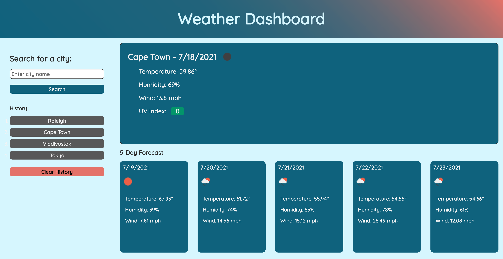

# Weather Dashboard
This project focuses on using a 3rd party API, specifically the Open Weather One-Call API, to create a weather dashboard to allow a user to search for their city (or any city) and see the current weather as well as a 5-day forecast for that city.

I began by creating the layout, opting for pure CSS instead of a framework to continue honing my pure CSS skills. 

Next I implemented the <code>localStorage</code> functionality, adding searched cities to the history, both in the local storage as well as on the page. This included adding event listeners to each history item, as well as enabling and disabling the "Clear History" button when appropriate.

## Screenshot of completed application:

## Link to deployed application:
[Tucker Barrett's Weather Dashboard](http://grinninbarrett.github.io/weather-dashboard "Tucker's deployed Weather Dashboard application")